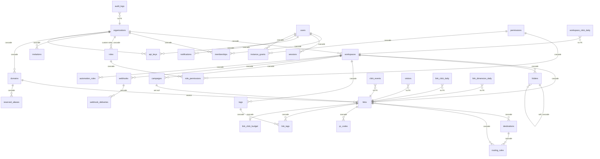

# Data model

The entity relationships and the per-table implementation status, which
[Plan.md](../Plan.md) and the `00600_phase2_dormant.sql` migration header have
pointed at since Phase 1. It existed as a reference in two files and nowhere
else until 0.2.0.

**Derived from the migrated schema, not from the migrations.** Every table,
column count and foreign key below was read out of a database with all 35
migrations applied, so this describes what a running instance has rather than
what the files appear to say. The distinction matters here: partitions are
created by application code and never appear in sqlc-visible SQL, so a reader
walking the migration files alone would not find them.

**Scope.** Structure and status. What each table *means* is in the migration that
created it, which is where the reasoning lives; this document is the map, and a
map that restated the territory would be a second thing to keep true.

## The shape of it

Four groups, and the arrows that cross between them are the interesting ones.

**Four edges are deliberately absent** and are drawn as *no FK* above, because
their absence is a design decision rather than an oversight:

- **The analytics tables** (`click_events`, `visitors`, and the three rollups)
  carry `link_id` and `workspace_id` with no constraint. A foreign key would put
  a tenancy write behind an analytics lock and make a partition drop consider
  them. The cost is that nothing cascades them, which is why
  `DeleteOrganizationRollups` exists — [F106](build-notes/deferred-findings.md)
  is what happens when that cost is not paid.
- **`audit_logs.organization_id`** carries no key, so the trail an organization
  wrote outlives the row it describes. A tenancy teardown that erased its own
  record is the one shape an audit log must not have.
- **`destination_disputes`** references nothing by design (`01600`), because a
  dispute is about a destination that was *refused* and therefore never became a
  row.
- **`blocked_destinations`** is an instance-wide list with no tenant.

## Every table, and what it is

Column counts are as migrated. *Partitioned* means `PARTITION BY RANGE`, with
partitions created two months ahead by application code — `PARTITION OF` never
appears in sqlc-visible SQL.

### Identity and tenancy

| Table | Cols | Status | Notes |
| --- | --- | --- | --- |
| `users` | 18 | Built | No deletion path exists — see *What is not built*. `anonymized_at` has no writer. |
| `organizations` | 8 | Built | `deleted_at` exists and **nothing writes it**; `DeleteOrganization` is a hard `DELETE`. |
| `workspaces` | 9 | Built | |
| `memberships` | 7 | Built | `workspace_id` NULL means organization-wide; a set one scopes the membership to that workspace (D31, D44). |
| `roles` | 8 | Built | `organization_id` NULL is a built-in role. Custom roles are structural only — nothing creates one. |
| `permissions` | 3 | Built | Seeded by migration, including the instance-level ones (D98). |
| `role_permissions` | 2 | Built | |
| `sessions` | 10 | Built | `workspace_id` is the session's current workspace (M25). |
| `instance_grants` | 4 | Built | The instance principal's permissions (D98, `03400`). |
| `invitations` | 12 | Built | Single-use, address-bound (D27), expiring (D29). |
| `pending_registrations` | 9 | Built | Self-serve signup (M29). Swept when its window lapses. |

### Links and routing

| Table | Cols | Status | Notes |
| --- | --- | --- | --- |
| `links` | 28 | Built | The widest table in the schema, and the one on the redirect path. |
| `domains` | 17 | Built | The instance default has `organization_id IS NULL`; custom domains are per organization or per workspace (M39, M40). |
| `reserved_aliases` | 4 | Built | An alias that received traffic stays reserved after its link is purged (F28). |
| `destinations` | 11 | Built | Where a link sends people. A link's own destination plus one row per rule or split arm. |
| `routing_rules` | 10 | Built | `kind` distinguishes a match rule from a split arm (M34, M36). |
| `folders` | 7 | Built | Self-referencing tree; the cycle rule is enforced in Go over a locked tree ([M38](build-notes/phase-details/m38.md)'s reopening). |
| `tags` / `link_tags` | 5 / 3 | Built | |
| `campaigns` | 11 | Built | `ON DELETE SET NULL` — deleting a campaign unfiles its links rather than taking them. |
| `qr_codes` | 6 | Built | |
| `link_click_budget` | 7 | Built | The durable counter behind max-click gates and sequential splits (M35, M36). |
| `blocked_destinations` | 5 | Built | The runtime blocklist. `source` separates the environment list, the review queue and the seeded shorteners. |
| `destination_disputes` | 14 | Built | No foreign keys, by design (`01600`). |

### Analytics

| Table | Cols | Status | Notes |
| --- | --- | --- | --- |
| `click_events` | 17 | Built, partitioned | `ip_prefix` only — no address column exists anywhere, asserted by a test against the live schema. |
| `visitors` | 6 | Built, partitioned | Daily unique-visitor hashes, salted; the salt is what makes them irreversible once purged. |
| `analytics_salts` | 4 | Built | Purged after two days, which is the de-identification step rather than housekeeping. |
| `link_click_daily` | 7 | Built | 60-second rollup. |
| `link_dimension_daily` | 7 | Built | 15-minute rollup (M37) — the cadence difference is what [F107](build-notes/deferred-findings.md) was about. |
| `workspace_click_daily` | 7 | Built | |

### Operations

| Table | Cols | Status | Notes |
| --- | --- | --- | --- |
| `audit_logs` | 12 | Built, partitioned | 32 actions, enumerated by `audit.AllActions` and checked by a test. |
| `notifications` | 9 | Built | Scoped to the reader and the workspace they are standing in, with organization-level news visible from every workspace (D102). |
| `mail_outbox` | 11 | Built | Optional: an instance with no `SMTP_HOST` never queues. Bodies are blanked when a row finishes (F32). |
| `webhooks` / `webhook_deliveries` | 10 / 11 | Built | Delivery is instance-wide and arrival-ordered, which is a recorded limitation (F90). |
| `automation_rules` | 11 | Built | `last_fired_at` is the watermark that stops a rule firing twice for one subject. |
| `job_state` | 6 | Built | The scheduler's cursors and watermarks. |

## What is not built

Structure that exists and has no writer, or that a document has promised. Listed
because a reader finding the column otherwise concludes the feature is there.

- **`users.anonymized_at`** — carries a comment naming a GDPR erasure routine
  since the first migration and has no writer. There is no account deletion of
  any kind; see [Plan.md](../Plan.md)'s *Not in Phase 2*.
- **`organizations.deleted_at`** — no writer. `DeleteOrganization` is a hard
  `DELETE`, so the column is available for a restore window nobody has built.
  `ResolveWorkspaceForUser` filters it anyway, which is
  [F25](build-notes/deferred-findings.md).
- **Custom roles** — `roles.organization_id` exists and nothing creates a row
  with it set. Every role today is built-in.
- **Dormant jsonb** — `00600` added columns for structure whose feature had not
  arrived. The rule is that dormant structure is jsonb until the feature lands;
  what remains dormant is listed in that migration's header rather than repeated
  here.

## Keeping this true

Nothing generates this file, and that is a gap rather than a decision — the
column counts and the foreign-key list came from a live migrated database and
will drift the moment a migration lands without somebody re-reading them. It is
recorded here rather than left implicit: a table below that gains a column
between releases makes this document quietly wrong, in the same way a
hand-maintained count did twice in `SECURITY.md` before `audit.AllActions`
existed.
