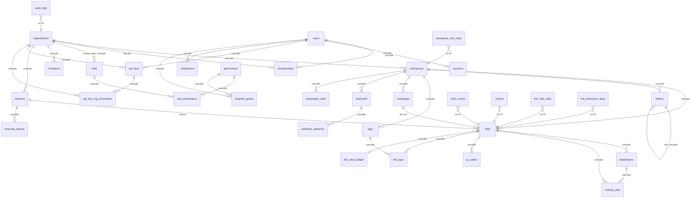

# Data model

The entity relationships and the per-table implementation status, which
[Plan.md](../Plan.md) and the `00600_phase2_dormant.sql` migration header have
pointed at since Phase 1. It existed as a reference in two files and nowhere
else until 0.2.0.

**Derived from the migrated schema, not from the migrations.** Every table,
column count and foreign key below was read out of a database with **all 44**
migrations applied — the count as of 0.3.0, counted from
`internal/store/migrations/` rather than recalled. It said *35* until then, and
was already one short when 0.2.0 shipped with 36; Phase 3 added the other eight.
It describes what a running instance has rather than
what the files appear to say. The distinction matters here: partitions are
created by application code and never appear in sqlc-visible SQL, so a reader
walking the migration files alone would not find them.

**Scope.** Structure and status. What each table *means* is in the migration that
created it, which is where the reasoning lives; this document is the map, and a
map that restated the territory would be a second thing to keep true.

## The shape of it

Four groups, and the arrows that cross between them are the interesting ones.

**Four edges are deliberately absent** and are drawn as *no FK* above, because
their absence is a design decision rather than an oversight:

- **The analytics tables** (`click_events`, `visitors`, and the three rollups)
  carry `link_id` and `workspace_id` with no constraint. A foreign key would put
  a tenancy write behind an analytics lock and make a partition drop consider
  them. The cost is that nothing cascades them, which is why
  `DeleteOrganizationRollups` exists — [F106](build-notes/deferred-findings.md)
  is what happens when that cost is not paid.
- **`audit_logs.organization_id`** carries no key, so the trail an organization
  wrote outlives the row it describes. A tenancy teardown that erased its own
  record is the one shape an audit log must not have.
- **`destination_disputes`** references nothing by design (`01600`), because a
  dispute is about a destination that was *refused* and therefore never became a
  row.
- **`blocked_destinations`** is an instance-wide list with no tenant.

## Every table, and what it is

Column counts are as migrated. *Partitioned* means `PARTITION BY RANGE`, with
partitions created two months ahead by application code — `PARTITION OF` never
appears in sqlc-visible SQL.

### Identity and tenancy

| Table | Cols | Status | Notes |
| --- | --- | --- | --- |
| `users` | 19 | Built | Deletion is **soft** (M52): `deleted_at` and `status = 'deleted'` are written and the row stays, which is what releases the address through the partial `users_email_key` and what gives the erasure sweep something to mark. `anonymized_at` is that mark, set by the hourly pass once the residue is scrubbed. `status = 'suspended'` still has **no writer**, deliberately. `mfa_secret` and `mfa_enabled_at` waited from the first migration until 0.3.0 for a writer that *sets* them ([M53](build-notes/phase-details/m53.md)); M52's erasure sweep was the first writer of either and it clears them. `mfa_last_step` (`04100`) is the replay guard: the highest TOTP step accepted, so a code from that step or earlier is refused inside its own window. |
| `organizations` | 8 | Built | `deleted_at` exists and **nothing writes it**; `DeleteOrganization` is a hard `DELETE`. |
| `workspaces` | 9 | Built | |
| `memberships` | 7 | Built | `workspace_id` NULL means organization-wide; a set one scopes the membership to that workspace (D31, D44). |
| `roles` | 8 | Built | `organization_id` NULL is a built-in role. Custom roles are structural only — nothing creates one. |
| `permissions` | 3 | Built | Seeded by migration, including the instance-level ones (D98). |
| `role_permissions` | 2 | Built | |
| `sessions` | 10 | Built | `workspace_id` is the session's current workspace (M25). |
| `instance_grants` | 4 | Built | The instance principal's permissions (D98, `03400`). |
| `invitations` | 12 | Built | Single-use, address-bound (D27), expiring (D29). |
| `pending_registrations` | 9 | Built | Self-serve signup (M29). Swept when its window lapses. |
| `password_resets` | 6 | Built | Account recovery (M51, `03900`). The third bearer-token table, after invitations and registrations: only a SHA-256 is stored, single-use, one hour. Swept hourly, and every row for an account is spent when one of them is used. |
| `mfa_recovery_codes` | 5 | Built | Ten single-use codes per enrolment ([M53](build-notes/phase-details/m53.md), `04100`). SHA-256 only, globally unique so two accounts cannot hold one secret, and kept after being spent so the account page can count what is left. Regenerating deletes the set outright — the previous one is void in full, and a count of leftovers from a void set would be a lie. |
| `api_keys` | 15 | Built | `user_id` is the owner and is what a revoke keys on. **`organization_id` is nullable since M54 (`04200`)**: NULL is account-wide — the key reaches every organization its owner holds an organization-wide membership in — and non-NULL is pinned to that one. `workspace_id` is the third, narrowest reach, and the two axes are independent, which is why they are two columns and not a `reach` enum. Only an HMAC of the token is stored. **This table was absent from this document until 0.3.0**, while appearing in the diagram above. |
| `api_key_org_revocations` | 4 | Built | One row per organization an administrator has cut an **account-wide** key out of ([M54](build-notes/phase-details/m54.md), `04200`). A pinned key never has one — its organization is its whole reach. Read on the authentication path to decide where a request lands, and since M58 also to bound what the key may be *told* about ([F183](build-notes/deferred-findings.md)). Also absent from this document until 0.3.0. |
| `mfa_pending_logins` | 8 | Built | The step between a right password and a session (`04100`). The fourth bearer-token table and the shortest-lived: SHA-256 only, single-use, five minutes. A table rather than a signed cookie because single use needs a server-side record of whether it has been spent, at which point the table is back and the cookie is an optimisation. Carries the sign-in's `ip_prefix` and user agent, so the session it mints records where the sign-in *started*. Swept hourly with no retention window — a spent one is evidence of nothing, because the session it minted is the record. |

### Links and routing

| Table | Cols | Status | Notes |
| --- | --- | --- | --- |
| `links` | 28 | Built | The widest table in the schema, and the one on the redirect path. |
| `domains` | 17 | Built | The instance default has `organization_id IS NULL`; custom domains are per organization or per workspace (M39, M40). |
| `reserved_aliases` | 4 | Built | An alias that received traffic stays reserved after its link is purged (F28). |
| `destinations` | 11 | Built | Where a link sends people. A link's own destination plus one row per rule or split arm. |
| `routing_rules` | 10 | Built | `kind` distinguishes a match rule from a split arm (M34, M36). |
| `folders` | 7 | Built | Self-referencing tree; the cycle rule is enforced in Go over a locked tree ([M38](build-notes/phase-details/m38.md)'s reopening). |
| `tags` / `link_tags` | 5 / 3 | Built | |
| `campaigns` | 11 | Built | `ON DELETE SET NULL` — deleting a campaign unfiles its links rather than taking them. |
| `qr_codes` | 10 | Built | One row per (link, code). **`is_default` marks the code an untagged scan resolves through** (`04400`, D183) — a picture carrying no code parameter, which is every picture printed before per-code identity existed, is counted against it. Exactly one per link, which `qr_codes_link_default_key` enforces; the empty `slug` used to carry that identity, which is what made the default undeletable, and now marks only a code with nobody to be told apart from. A code gains a slug at the moment a second one appears beside it, and the slug travels in its payload and is resolved against the link's own codes on the redirect path. **`logo bytea` is the only user-uploaded content in this schema** ([M50.5](build-notes/phase-details/m50.5.md), D134): a PNG this product re-encoded, at most 1,060,000 bytes, so a link at the twenty-code cap is bounded at about 20 MiB. It is in the row and therefore in every `pg_dump` — the accepted cost of deletion coming free with the cascades already here. The four reads in `query/campaigns.sql` project `logo IS NOT NULL` rather than the column, so listing a link's codes does not fetch its images; `GetQRCodeLogo` is the one statement that reads the bytes, added by [M50.6](build-notes/phase-details/m50.6.md) for the surface that composites them into the picture, and it is called once per drawn code and only for a code whose `has_logo` already said there is something to fetch. **`style` still holds no logo reference** — under D134 the bytes are a column on the row, not a field in the blob, so `00600_phase2_dormant.sql`'s comment naming a *logo reference* among the blob's contents describes a shape this schema did not take. |
| `link_click_budget` | 7 | Built | The durable counter behind max-click gates and sequential splits (M35, M36). |
| `blocked_destinations` | 5 | Built | The runtime blocklist. `source` separates the environment list, the review queue and the seeded shorteners. |
| `destination_disputes` | 14 | Built | No foreign keys, by design (`01600`). |

### Analytics

| Table | Cols | Status | Notes |
| --- | --- | --- | --- |
| `click_events` | 17 | Built, partitioned | `ip_prefix` only — no address column exists anywhere, asserted by a test against the live schema. |
| `visitors` | 6 | Built, partitioned | Daily unique-visitor hashes, salted; the salt is what makes them irreversible once purged. |
| `analytics_salts` | 4 | Built | Purged after two days, which is the de-identification step rather than housekeeping. |
| `link_click_daily` | 7 | Built | 60-second rollup. |
| `link_dimension_daily` | 7 | Built | 15-minute rollup (M37) — the cadence difference is what [F107](build-notes/deferred-findings.md) was about. |
| `workspace_click_daily` | 7 | Built | |

### Operations

| Table | Cols | Status | Notes |
| --- | --- | --- | --- |
| `audit_logs` | 12 | Built, partitioned | 39 actions, enumerated by `audit.AllActions` and checked by a test. `actor_label` is rewritten to a constant tombstone by the erasure sweep; `actor_user_id` is not (D148). Since M58 the same statement also rewrites `metadata`'s `"email"` key and the `"from"` array beside it, matched on the value because there is no key to match on. **One statement, not several**: two data-modifying CTEs writing one row leave Postgres to apply one and drop the other, which a record that is both the erased actor's and carries their address hits every time. |
| `notifications` | 9 | Built | Scoped to the reader and the workspace they are standing in, with organization-level news visible from every workspace (D102). Deleted with their own reader's account, and **scrubbed** when somebody else's account is erased: the row telling an inviter that their invitation was accepted names the person who accepted it, in `data` and in `title` alike, and belongs to neither of the two sweeps that would otherwise reach it (M58, D176). |
| `mail_outbox` | 11 | Built | Optional: an instance with no `SMTP_HOST` never queues. Bodies are blanked when a row finishes (F32). |
| `webhooks` / `webhook_deliveries` | 10 / 11 | Built | Delivery is instance-wide and arrival-ordered, which is a recorded limitation (F90). |
| `automation_rules` | 12 | Built | `last_fired_at` is the watermark that stops a rule firing twice for one subject. *(Counted 11 here until 0.3.0; `03600` added the watermark's subject column and the count did not move with it.)* |
| `instance_settings` | 4 | Built | A singleton — the instance's own settings, which had nowhere to live before D161. Today it holds `update_check_enabled`, three-valued: NULL means the operator has not been asked yet, which is what makes *never answering* a refusal rather than a default (`04300`). Absent from this document until 0.3.0. |
| `job_state` | 6 | Built | The scheduler's cursors and watermarks. |

## What is not built

Structure that exists and has no writer, or that a document has promised. Listed
because a reader finding the column otherwise concludes the feature is there.

- **`users.status = 'suspended'`** — admitted by the CHECK constraint since the
  first migration and written by nothing. `active` is the default and `deleted`
  is M52's; suspension is a moderation feature nobody has asked for, and its
  absence is asserted by `TestNothingWritesTheSuspendedStatus` rather than left
  to be discovered. *(`users.anonymized_at` was on this list until 0.3.0. It has
  a writer now — the erasure sweep — which is what M52 built.)*
- **`organizations.deleted_at`** — no writer. `DeleteOrganization` is a hard
  `DELETE`, so the column is available for a restore window nobody has built.
  `ResolveWorkspaceForUser` filters it anyway, which is
  [F25](build-notes/deferred-findings.md).
- **Custom roles** — `roles.organization_id` exists and nothing creates a row
  with it set. Every role today is built-in.
- **Dormant jsonb** — `00600` added columns for structure whose feature had not
  arrived. The rule is that dormant structure is jsonb until the feature lands.
  **Its header no longer describes what is dormant, because almost nothing in it
  is**: every table that file created has a writer now, and the blob comments
  inside it were trued up at 0.3.0 against the structs that actually fill them.
  What is left dormant is a *shape inside a blob* rather than a table —
  `qr_codes.style` has six fields and its comment named two more, one of which
  (a module shape) is still unbuilt and is now recorded as unscheduled in
  [phase-3-candidates.md](build-notes/phase-3-candidates.md). *(This row pointed
  at that header for the list until 0.3.0, and the header had never carried
  one.)*

## What is not in this document: an add-on's tables

Everything above is in the `public` schema and is this product's. An installed
add-on that declared `storage.own_schema` also has tables, in a schema of its own
called `addon_<name>`, and **none of them are described here or anywhere else in
this repository** — they are the add-on author's, they arrive with the module, and
the host applies their DDL without understanding it.

Three consequences worth reading before you meet one:

- **`pg_dump` of the database includes them**, because they are schemas in the
  same database — but **not the roles that own them**, and that half is
  load-bearing. `pg_dump` carries no roles at all; `pg_dumpall --roles-only` is
  what does, which is the command
  [deployment.md](deployment.md#5-back-it-up)'s backup runs — `--globals-only`
  carries them too, along with tablespaces and database-level grants a
  single-database restore does not need. Restore a whole-database dump into a cluster whose roles were not
  restored first and the `ALTER … OWNER TO` lines fail, the next boot repairs the
  *schema*'s owner and nothing re-owns the tables, so the add-on's own role is
  refused on its own rows — measured, and the load says so rather than failing
  inside a migration. So a backup is whole only if it is two files;
  [deployment.md](deployment.md) has both and the order to restore them in.
  `pg_dump --schema=addon_<name>` is the per-add-on form, and that
  is the whole of this release's backup story for add-ons — there is no tooling
  beyond what `pg_dump` already is, stated rather than implied. What that per-schema
  form does **not** carry is a **large object**, which belongs to no schema at all:
  nothing in LinkCtrl creates one and an add-on's role can, so
  [operations.md](operations.md#add-ons) carries the gauge that says whether any
  exist and the purge that removes them. A whole-database dump does carry them, so
  this is a bound on `--schema=` and not on the backup story.
- **Nothing this document says about column counts, foreign keys or partitioning
  covers them.** An add-on's schema has whatever its author wrote.
- **A schema can outlive its add-on.** Removing a module leaves its schema and its
  rows; the boot log names one nothing claims. [operations.md](operations.md#add-ons)
  has what to do about it.

The boundary between the two is a database role rather than a convention, and
[SECURITY.md](SECURITY.md) is where that is argued.

## Keeping this true

Nothing generates this file, and that is a gap rather than a decision — the
column counts and the foreign-key list came from a live migrated database and
will drift the moment a migration lands without somebody re-reading them. It is
recorded here rather than left implicit: a table below that gains a column
between releases makes this document quietly wrong, in the same way a
hand-maintained count did twice in `SECURITY.md` before `audit.AllActions`
existed.
